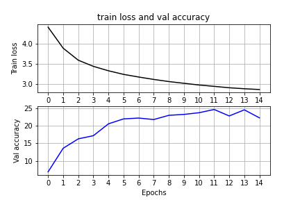
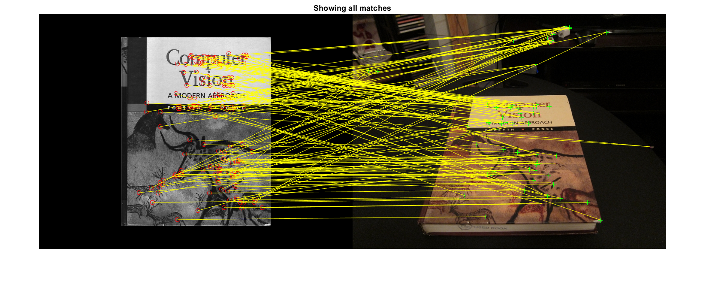
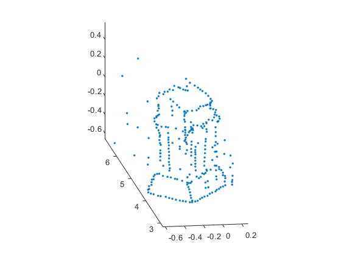
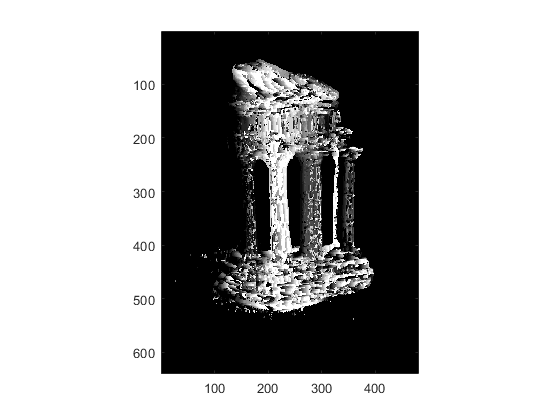

# CMPT412
**Computational Vision**

1. Integer Recognition with Convolutional Neural Networks

3. Deep Learning with PyTorch

4. Augmented Reality with Planar Homographies

5. 3D Reconstruction

